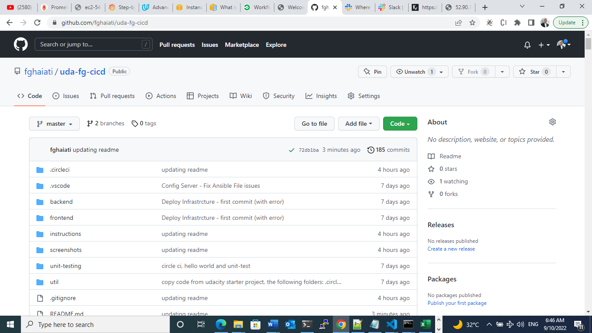
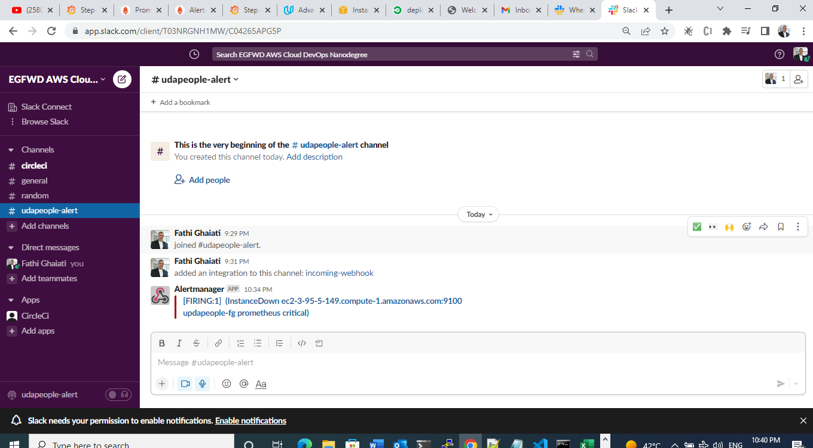

## Udacity Advanced DevOps Nanodegree 3rd Project
## Give Your Application Auto-Deploy Superpowers Project
 
> - By: Fathi Ghaiati
> - fathi.ghaiati@gmail.com
> - August 2022 / September 2022
> - About: This project has submitted under my udacity Advanced DevOps Nanodegree Journey

### Objectives
This project, is requested for the purpose to enable me to prove my mastery of the following learning objectives:

- Explain the fundamentals and benefits of CI/CD to achieve, build, and deploy automation for cloud-based software products.
- Utilize Deployment Strategies to design and build CI/CD pipelines that support Continuous Delivery processes.
- Utilize a configuration management tool to accomplish deployment to cloud-based servers.
- Surface critical server errors for diagnosis using centralized structured logging.

### Project Requirements - Guiding Instructions 
- starter project: [URL](https://github.com/udacity/cdond-c3-projectstarter)

* [Selling CI/CD](instructions/0-selling-cicd.md)
* [Getting Started](instructions/1-getting-started.md)
* [Deploying Working, Trustworthy Software](instructions/2-deploying-trustworthy-code.md)
* [Configuration Management](instructions/3-configuration-management.md)
* [Turn Errors into Sirens](instructions/4-turn-errors-into-sirens.md)

### Project Submission

#### urls(urls.txt)
- A text file named `urls.txt` includes:
  > HINT: URL*_SCREENSHOT's urls may differ than latest urls submission as aws stops images automatically (brings it down) and when manually start instances aws changes the ip-address and image-link
```
  - actions after aws changes ip-addresses
  - get new endpoint/ip-address of backend server from aws
  - ssh to prometheus server
  - change end point in prometheus targets: sudo nano /etc/prometheus/prometheus.yml
  - restart prometheus service: sudo systemctl restart prometheus
```
     
  1. Public Url to GitHub repository (not private) [URL01](https://github.com/fghaiati/uda-fg-cicd)
  

  1. Public URL for the project's S3 Bucket (green candidate front-end) [URL02]
  
  **screenshots/URL02_SCREENSHOT-10-sep-2022**
  


  1. Public URL for the project's CloudFront distribution (blue production front-end) [URL03]
  

  1. Public URLs to deployed application back-end in EC2 [URL04]
  
  **URL04_SCREENSHOT-10-sep-22**
  


  1. Public URL to the project's Prometheus Server [URL05]
  
  **URL05_SCREENSHOT-10-sep-22**
  


#### screenshots(screenshots/)
- Below are screenshots in PNG format, named using the screenshot number listed in the instructions. The screenshots are included in the screenshots/* folder

  1. Job failed because of compile errors. [SCREENSHOT01]
  
  
  
  1. Job failed because of unit tests. [SCREENSHOT02-*]
  
  
  
  
  1. Job failed because of vulnerable packages. [SCREENSHOT03]
  

  1. Alert from one of failed builds. [SCREENSHOT04-*]
  
  

  1. Appropriate job failure for infrastructure creation. [SCREENSHOT05]
  

  1. Appropriate job failure for the smoke test job. [SCREENSHOT06]
  

  1. Successful rollback after a failed smoke test. [SCREENSHOT07]  
  

  1. Successful promotion job. [SCREENSHOT08]
  

  1. Successful cleanup job. [SCREENSHOT09]
  

  1. Only deploy on pushed to `master` branch. [SCREENSHOT10]
  

  1. Prometheus Graphs of EC2 instance including available memory, available disk space, and CPU usage. [SCREENSHOT11]
  

  1. Alert that was sent by Prometheus. [SCREENSHOT12]
  

##### other-screenshots(screenshots/other-screenshots/)
  **Other screenshots - refer to at (screenshots/other-screenshots/)** 
  
  
  
  
  
  
  

#### Imporvements added
**- utilize circleci commands feature:**
```
  - notify-on-failure
  - notify-on-success
  - install-awscli
  - install-ansible
  _ install-nodejs 
```

**- multiple workflows with action parameter to enable partial run of the full workflow, this enable to unit-test ci/cd also benefit from if need to do specific set of jobs.**
```
parameters:
  action:
    type: enum
    enum: [default, scan, provision, configure-infrastructure, deploy-frontend, deploy, smoke-test, cleanup, force-destroy]
    default: deploy
```

**- Used kvdb.io added key to use for continuo working on a specific workflow, suport previous improvement**
```
curl -d "d684f7c" https://kvdb.io/6LGVUmfMFMbPAGkm3aLBkb/workon_specific_workflow_id
```

#### CI/CD Presentation 
"presentation.pdf" (presentation.pdf) PDF format. 

### Built With

- [Circle CI](www.circleci.com) - Cloud-based CI/CD service
- [Amazon AWS](https://aws.amazon.com/) - Cloud services
- [AWS CLI](https://aws.amazon.com/cli/) - Command-line tool for AWS
- [CloudFormation](https://aws.amazon.com/cloudformation/) - Infrastrcuture as code
- [Ansible](https://www.ansible.com/) - Configuration management tool
- [Prometheus](https://prometheus.io/) - Monitoring tool

### License

[License](LICENSE.md)
